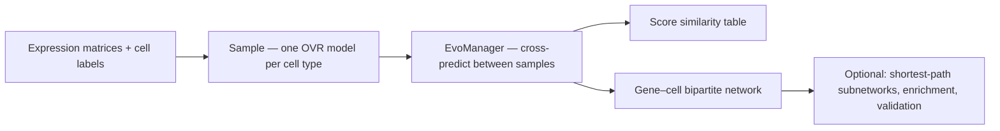

<p align="center">
  <!-- Logo: PyPI needs HTTPS absolute URLs; jsDelivr mirrors GitHub once <code>assets/logo.png</code> exists on <code>main</code>. Fallback: raw.githubusercontent.com -->
  <a href="https://github.com/Qotov/scEvoNet">
    
  </a>
</p>

<p align="center">
  <a href="https://pypi.org/project/scevonet/"></a>
  &#8239;
  <a href="https://doi.org/10.1186/s12859-023-05213-3"></a>
  &#8239;
  <a href="https://github.com/Qotov/scEvoNet/blob/main/examples/02_PBMC3k_full_workflow.ipynb"></a>
  &#8239;
  <a href="https://github.com/Qotov/scEvoNet/actions/workflows/tests.yml"></a>
  <br>
  <a href="https://github.com/Qotov/scEvoNet/blob/main/LICENSE"></a>
  &#8239;
  <a href="https://pypi.org/project/scevonet/"></a>
  &#8239;
  <a href="https://github.com/astral-sh/ruff"></a>
</p>

**scEvoNet** predicts **cell-state similarity** and builds **gene–cell-type** networks from single-cell RNA-seq. For each cell type you define, it trains a one-vs-rest **LightGBM** model (with a top-feature refinement step designed for sparse expression and cross-dataset use). Models trained on one sample score cells in another, yielding a **similarity-style matrix** and a **bipartite graph** (genes linked to cell types by importance).

Typical uses: **cross-species** atlases, **developmental stages**, **primary tumor vs metastasis**, or any pair of annotated matrices you want to compare at the level of programs and states.

Method paper: [Kotov et al., *BMC Bioinformatics* 2023](https://doi.org/10.1186/s12859-023-05213-3) · [PubMed](https://pubmed.ncbi.nlm.nih.gov/36879200/) · [PMC full text](https://pmc.ncbi.nlm.nih.gov/articles/PMC9990205/)

---

## Requirements

- **Python** ≥ 3.9  
- **Input**: cells × genes `pandas.DataFrame` (or build from AnnData via optional helper), plus per-cell type / cluster labels.  
- **Gene IDs** must be consistent across samples if you compare species—orthology mapping is not built into the core pipeline.

On **macOS**, if `import lightgbm` fails with a missing **OpenMP** (`libomp`) error, install OpenMP for your stack (for example **`brew install libomp`**, or **`conda install -c conda-forge libomp`** if you use conda), then retry.

---

## Installation

Install **[uv](https://docs.astral.sh/uv/)** ([installation](https://docs.astral.sh/uv/getting-started/installation/)). All commands below use **`uv`** (including **`uv pip install`**, which is uv’s installer—not the legacy `pip` tool).

### Install from PyPI

```bash
uv pip install scevonet
```

Optional extras:

| Extra | Purpose |
|--------|---------|
| `enrichment` | Gene-set ORA via **gseapy** / Enrichr (`enrich_genes`, …) |
| `anndata` | `sample_from_adata(...)` for Scanpy-style `AnnData` |
| `dev` | **pytest**, **pytest-cov**, **Ruff**, **scanpy**, **ipykernel** (tests, notebooks; PBMC3k cached after first run) |
| `all` | `anndata` + `enrichment` |

```bash
uv pip install 'scevonet[enrichment]'
uv pip install 'scevonet[anndata]'
uv pip install 'scevonet[all]'
```

In a **uv-managed project** you can instead run **`uv add scevonet`** (or **`uv add 'scevonet[anndata]'`**, etc.) from the project root.

### Clone this repository (contributors)

```bash
git clone https://github.com/Qotov/scEvoNet.git
cd scEvoNet
uv sync
```

This creates **`.venv/`**, installs the package in **editable** mode, and applies the **default `dev`** dependency group from **`uv.lock`** (pytest, ruff, scanpy, ipykernel, …). The interpreter is pinned in **`.python-version`**; override with e.g. **`uv sync --python 3.10`**.

Optional feature extras:

```bash
uv sync --extra enrichment --extra anndata
# or
uv sync --all-extras
```

#### Example notebooks (Jupyter / VS Code)

After **`uv sync`** in the repo:

```bash
uv run python -m ipykernel install --user --name scevonet --display-name "Python (scEvoNet)"
```

In **VS Code / Cursor**: pick kernel **“Python (scEvoNet)”**, or **Python: Select Interpreter** → **`.venv/bin/python`**. Open notebooks under **`examples/`**.

#### Lint & format ([Ruff](https://docs.astral.sh/ruff/))

```bash
uv run ruff check scevonet tests
uv run ruff format --check scevonet tests   # verify only
uv run ruff format scevonet tests           # apply formatting
```

#### Tests

Integration tests load **PBMC3k** via **scanpy** (included in the **dev** group). First run downloads the dataset once into Scanpy’s cache. From a clone use **`uv sync`** (default **dev** group includes **scanpy**).

```bash
uv run pytest tests/ -q
```

When you change dependencies in **`pyproject.toml`**, run **`uv lock`** and commit **`uv.lock`**.

---


## Workflow (conceptual)



---

## Minimal example

```python
import pandas as pd
from scevonet import Sample, SampleConfig, EvoManager

# One Sample per dataset: matrix columns = genes, rows = cells (same convention throughout).
cfg = SampleConfig(top_features_limit=3000, n_estimators=500)
df_a = pd.read_csv("sample_a.csv", index_col=0)  # your preprocessing
df_b = pd.read_csv("sample_b.csv", index_col=0)
labels_a = [...]  # list of str, length = df_a.shape[0]
labels_b = [...]  # list of str, length = df_b.shape[0]

sample_a = Sample(df_a, labels_a, config=cfg)
sample_b = Sample(df_b, labels_b, config=cfg)

em = EvoManager(sample_a, sample_b)

# Cross-dataset prediction scores (clustermap-friendly):
similarity = em.cell_types_similarity

# Long-format edges Gene — Cell_type — Importance:
edges = em.network

# Optional: subnetwork between two annotated types (see docs / notebook)
# subgraph = em.generate_cell_type_network("type_a", "type_b")
```

### Example notebooks

| Notebook | Description |
|----------|-------------|
| [**01_quickstart_synthetic**](examples/01_quickstart_synthetic.ipynb) | Minimal **self-contained** pipeline (random matrix, no downloads). |
| [**02_PBMC3k_full_workflow**](examples/02_PBMC3k_full_workflow.ipynb) | **End-to-end API** with PBMC3k-derived demo data (`scanpy` + `scevonet.pbmc_demo`), validation, plotting, optional enrichment. |
| [**03_xenopus_embryo_legacy**](examples/03_xenopus_embryo_legacy.ipynb) | Original Xenopus embryo pickle workflow *(needs external `.pkl` files — see notebook)*. |

From a clone, run **`uv sync`** (default **dev** group includes **scanpy**, **ipykernel**, and test tools). From PyPI only, use **`uv pip install 'scevonet[dev]'`** if you need the same extras without the repo.

---

## Main API (high level)

| Module idea | Functions / classes |
|-------------|---------------------|
| Core | `Sample`, `SampleConfig`, `EvoManager`, `fit_ovr_model` |
| AnnData | `sample_from_adata` (requires `[anndata]`) |
| Interpretation | `classify_transition_genes`, `cluster_mean_expression`, `enrich_genes`, `enrich_by_cell_type_programs` (enrichment needs `[enrichment]`) |
| Validation | `bootstrap_importance_stability`, `permutation_importance_null`, `leave_batch_out_auc` |
| Plotting | `draw_net`, `draw_network`, `finish_matplotlib_figure` |

Full symbol list: `import scevonet; help(scevonet)` or see `scevonet/__init__.py`.

---

## Citation

If you use scEvoNet in research, please cite:

```bibtex
@article{kotov2023scevonet,
  title   = {scEvoNet: a gradient boosting-based method for prediction of cell state evolution},
  author  = {Kotov, Aleksandr and Zinovyev, Andrei and Monsoro-Burq, Anne-Helene},
  journal = {BMC Bioinformatics},
  volume  = {24},
  number  = {83},
  year    = {2023},
  doi     = {10.1186/s12859-023-05213-3}
}
```

---

## License

This project is released under the [MIT License](LICENSE).

---

## Links

- [PyPI — scevonet](https://pypi.org/project/scevonet)  
- [Monsoro-Burq lab, Institut Curie](https://curie.fr/equipe/monsoro-burq)
