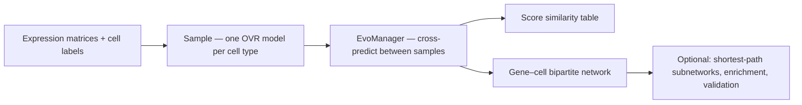

<p align="center">
  <!-- Relative to repo root: works on GitHub for every branch/tag. For PyPI, use an absolute URL after logo.png is on the default branch. -->
  
</p>

<p align="center">
  <a href="https://pypi.org/project/scevonet/"></a>
  <a href="https://pypi.org/project/scevonet/"></a>
  
</p>

**scEvoNet** predicts **cell-state similarity** and builds **gene–cell-type** networks from single-cell RNA-seq. For each cell type you define, it trains a one-vs-rest **LightGBM** model (with a top-feature refinement step designed for sparse expression and cross-dataset use). Models trained on one sample score cells in another, yielding a **similarity-style matrix** and a **bipartite graph** (genes linked to cell types by importance).

Typical uses: **cross-species** atlases, **developmental stages**, **primary tumor vs metastasis**, or any pair of annotated matrices you want to compare at the level of programs and states.

Method paper: [Kotov et al., *BMC Bioinformatics* 2023](https://doi.org/10.1186/s12859-023-05213-3) · [PubMed](https://pubmed.ncbi.nlm.nih.gov/36879200/) · [PMC full text](https://pmc.ncbi.nlm.nih.gov/articles/PMC9990205/)

---

## Requirements

- **Python** ≥ 3.9  
- **Input**: cells × genes `pandas.DataFrame` (or build from AnnData via optional helper), plus per-cell type / cluster labels.  
- **Gene IDs** must be consistent across samples if you compare species—orthology mapping is not built into the core pipeline.

On **macOS**, if `import lightgbm` fails with a missing **OpenMP** (`libomp`) error, install a build that ships OpenMP (for example `conda install -c conda-forge libomp`) or use **conda-forge**’s `lightgbm` package.

---

## Installation

### Users (PyPI)

```bash
pip install scevonet
```

Optional dependency groups:

| Extra | Purpose |
|--------|---------|
| `enrichment` | Gene-set ORA via **gseapy** / Enrichr (`enrich_genes`, …) |
| `anndata` | `sample_from_adata(...)` for Scanpy-style `AnnData` |
| `dev` | **pytest**, **pytest-cov**, **Ruff** (tests + lint/format for contributors) |
| `all` | `anndata` + `enrichment` |

```bash
pip install 'scevonet[enrichment]'
pip install 'scevonet[anndata]'
pip install 'scevonet[all]'
```

### Contributors — **uv** (recommended)

Development uses **[uv](https://docs.astral.sh/uv/)** so installs stay fast and pinned via **`uv.lock`**. Install uv ([instructions](https://docs.astral.sh/uv/getting-started/installation/)), then:

```bash
git clone https://github.com/Qotov/scEvoNet.git
cd scEvoNet
uv sync
```

This creates `.venv/`, installs the package in editable mode, and **includes the default `dev` group** (pytest, ruff, etc.)—so `uv run ruff` works without extra flags. The default interpreter is **`.python-version`**; override with e.g. `uv sync --python 3.10`.

Optional feature extras (AnnData, enrichment):

```bash
uv sync --extra enrichment --extra anndata
# or
uv sync --all-extras
```

#### Lint & format ([Ruff](https://docs.astral.sh/ruff/))

```bash
uv run ruff check scevonet tests
uv run ruff format --check scevonet tests   # verify only
uv run ruff format scevonet tests           # apply formatting
```

#### Tests

```bash
uv run pytest tests/ -q
```

#### Without uv (pip only)

```bash
pip install -e ".[dev]"
pytest tests/ -q
ruff check scevonet tests
ruff format --check scevonet tests
```

When you change dependencies in `pyproject.toml`, refresh the lockfile with **`uv lock`** and commit **`uv.lock`**.

---


## Workflow (conceptual)



---

## Minimal example

```python
import pandas as pd
from scevonet import Sample, SampleConfig, EvoManager

# One Sample per dataset: matrix columns = genes, rows = cells (same convention throughout).
cfg = SampleConfig(top_features_limit=3000, n_estimators=500)
df_a = pd.read_csv("sample_a.csv", index_col=0)  # your preprocessing
df_b = pd.read_csv("sample_b.csv", index_col=0)
labels_a = [...]  # list of str, length = df_a.shape[0]
labels_b = [...]  # list of str, length = df_b.shape[0]

sample_a = Sample(df_a, labels_a, config=cfg)
sample_b = Sample(df_b, labels_b, config=cfg)

em = EvoManager(sample_a, sample_b)

# Cross-dataset prediction scores (clustermap-friendly):
similarity = em.cell_types_similarity

# Long-format edges Gene — Cell_type — Importance:
edges = em.network

# Optional: subnetwork between two annotated types (see docs / notebook)
# subgraph = em.generate_cell_type_network("type_a", "type_b")
```

**Tutorial notebook:** [examples/HowToUse.ipynb](examples/HowToUse.ipynb)

---

## Main API (high level)

| Module idea | Functions / classes |
|-------------|---------------------|
| Core | `Sample`, `SampleConfig`, `EvoManager`, `fit_ovr_model` |
| AnnData | `sample_from_adata` (requires `[anndata]`) |
| Interpretation | `classify_transition_genes`, `cluster_mean_expression`, `enrich_genes`, `enrich_by_cell_type_programs` (enrichment needs `[enrichment]`) |
| Validation | `bootstrap_importance_stability`, `permutation_importance_null`, `leave_batch_out_auc` |
| Plotting | `draw_net`, `draw_network`, `finish_matplotlib_figure` |

Full symbol list: `import scevonet; help(scevonet)` or see `scevonet/__init__.py`.

---

## Citation

If you use scEvoNet in research, please cite:

```bibtex
@article{kotov2023scevonet,
  title   = {scEvoNet: a gradient boosting-based method for prediction of cell state evolution},
  author  = {Kotov, Aleksandr and Zinovyev, Andrei and Monsoro-Burq, Anne-Helene},
  journal = {BMC Bioinformatics},
  volume  = {24},
  number  = {83},
  year    = {2023},
  doi     = {10.1186/s12859-023-05213-3}
}
```

---

## License

This project is released under the [MIT License](LICENSE).

---

## Links

- [PyPI — scevonet](https://pypi.org/project/scevonet)  
- [Monsoro-Burq lab, Institut Curie](https://curie.fr/equipe/monsoro-burq)
